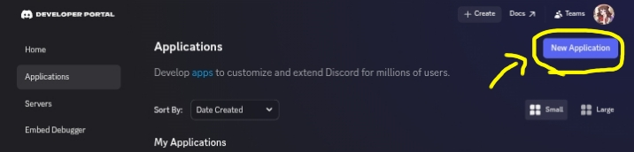
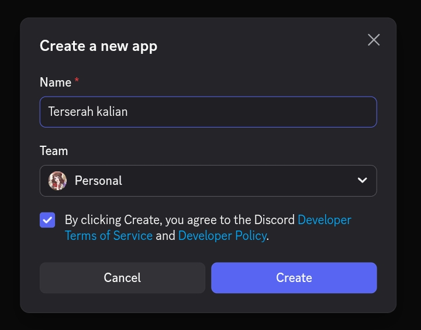
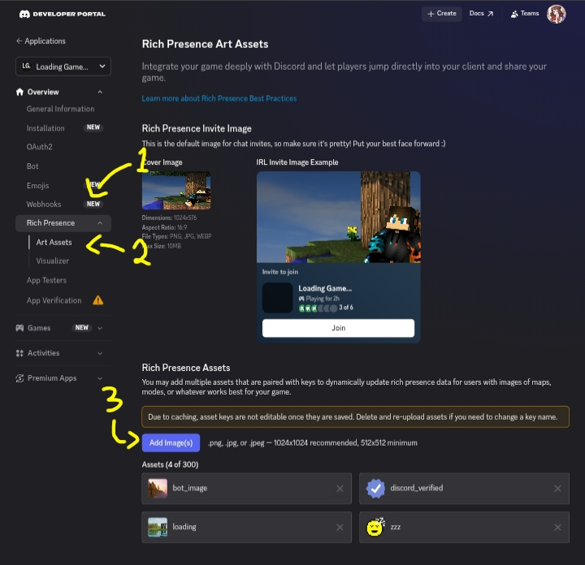

[Cek source codenya disini!](https://github.com/nurjavier8789/discord-presence-js)

Pernah gak sih kalian kepikiran untuk membuat tulisan custom di samping kata "Playing" atau "Listening to" di Discord? Well, ternyata gak cuma kalian aja yang berpikiran seperti itu. Diriku yang dulu juga berpikir begitu.

Kali ini aku mau sharing cara membuat Custom Discord Rich Presence menggunakan node.js!

# Persiapan
Yang perlu kalian siapkan yaitu:
- Laptop/PC
- [Node.js](https://nodejs.org)
- IDE/Tampat untuk coding (VSCode, notepad++, dkk.)
- Discord (pasti)

# Menyiapkan discord application
1. Pergi ke website [Discord Developer Portal](https://discord.com/developers/applications) kemudian buat aplikasi baru

2. Buat nama terserah kalian. Nama itu yang akan muncul di sebelah kata "Playing" atau "Listening to" (Contoh: "Playing `Terserah kalian`"

3. Buka aplikasi yang barusan kalian buat. Kemudian buka "Rich Presence

