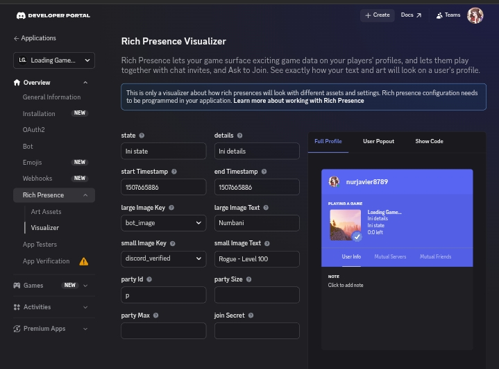
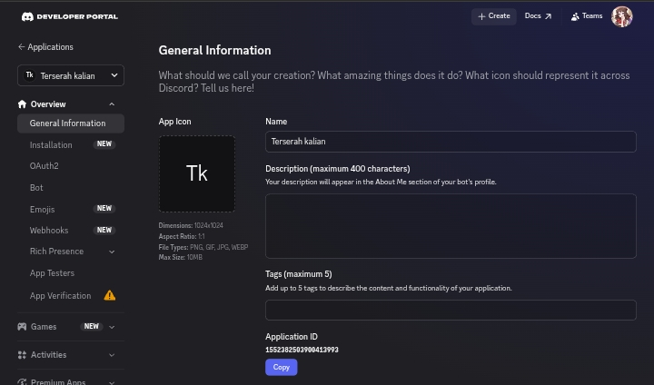

[Cek source codenya disini!](https://github.com/nurjavier8789/discord-presence-js)

Pernah gak sih kalian kepikiran untuk membuat tulisan custom di samping kata "Playing" di Discord? Well, ternyata gak cuma kalian aja yang berpikiran seperti itu. Diriku yang dulu juga berpikir begitu.

Kali ini aku mau sharing cara membuat Custom Discord Rich Presence menggunakan node.js!

# Persiapan
Yang perlu kalian siapkan yaitu:
- Laptop/PC
- [Node.js](https://nodejs.org)
- IDE/Tempat untuk coding (VSCode, notepad++, dkk.)
- Discord (pasti)

# Menyiapkan discord application
1. Pergi ke website [Discord Developer Portal](https://discord.com/developers/applications) kemudian buat aplikasi baru

2. Buat nama terserah kalian. Nama itu yang akan muncul di sebelah kata "Playing". Tapi bisa diganti juga saat coding nanti. (Contoh: "Playing `Terserah kalian`")

3. Buka aplikasi yang barusan kalian buat. Kemudian buka tab "Rich Presence > Art Assets" setelah itu kalian bisa tambahin gambar terserah kalian.
(Catatan: Saat upload gambar pastikan kalian kasih nama yang gampang biar enak ngodingnya.)\
(Catatan lagi: Jika saat kalian refresh halamannya dan gambar hilang, wajar saja karena discord masih memprosesnya. Tunggu beberapa menit setelah itu gambar kalian muncul kembali)

**Sedikit saran:**
- Kalian bisa cek gimana nanti bentuk presencenya di tab "Rich Presence > Visualizer"!

- Pastikan kalian menyimpan Application ID aplikasi kalian. Karena akan dibutuhkan saat ngoding nantinya!

# Persiapan sebelum ngoding
1. Buatlah folder kosong dimanapun
2. Buka command prompt (cmd) dan arahkan cmd ke folder untuk Custom Rich Presencenya.
3. Ketikan command ini di cmd:
    - `npm i discord-rpc`, pastikan sudah terinstall
    - `npm init`, jika tidak ingin ribet `npm init -y`
4. Buat file baru bernama bebas dengan akhiran `.js`. Pastikan pada settingan File explorer kalian bisa lihat extension file!
5. Buka file yang barusan kalian buat di VSCode atau notepad++ atau semacamnya
6. Ketik codenya seperti code dibawah ini
